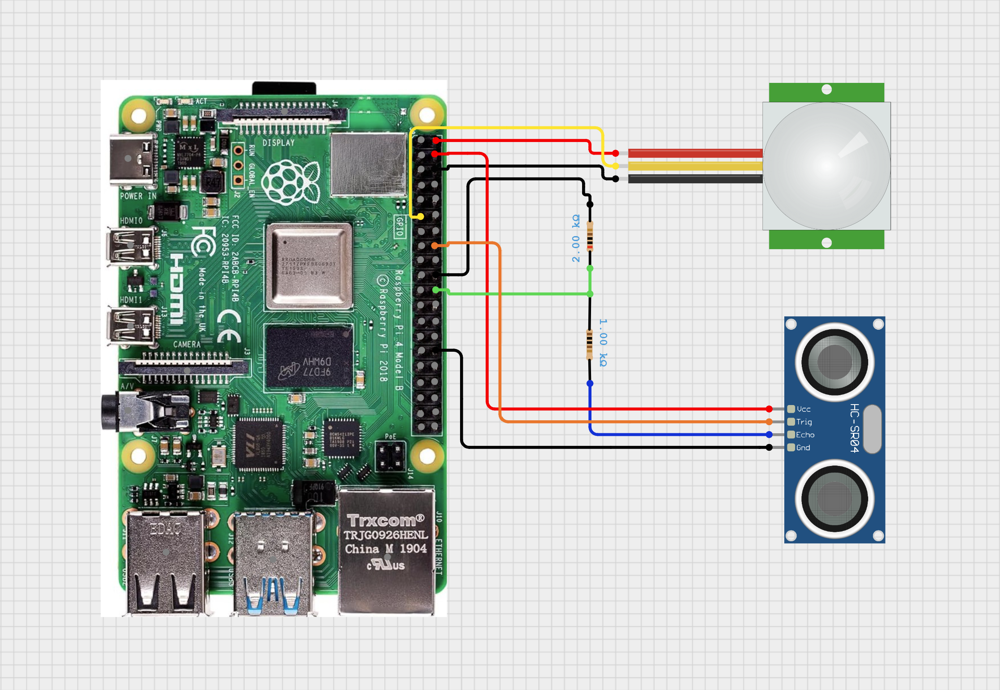
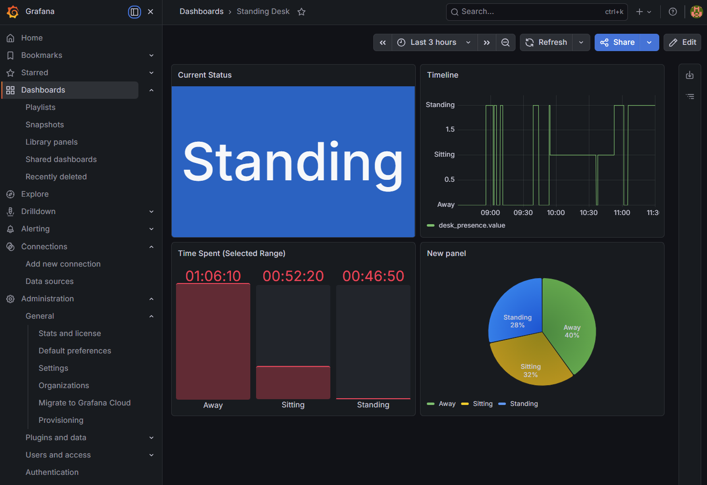

# Standing Desk Presence Tracker

## Background
After sitting at a desk most of the day every day for over 6 years (working from home), 
I got a standing desk. I wanted a way to track how much time I actually spend standing 
vs. sitting. I already had a DHT22 temperature and humidity sensor connected to a 
Raspberry Pi 4 that I was using as a secondary desktop. I realized I could use some 
cheap components (HC-SR501 PIR Motion and HC-SR04 Ultrasonic Distance sensors) to 
determine if I'm present at the desk, and if the desk is low (sitting) or high 
(standing). The Raspberry Pi 4 is sitting on top of a small file cabinet under a desk. 
The HC-SR04 Ultrasonic Distance sensor is pointing straight up at the bottom of the desk 
to determine desk height, and the PIR Motion sensor is pointing at where I sit/stand to 
determine presence.

## Overview

This project uses a Raspberry Pi with sensors to detect:
- Whether a user is present at their desk
- Whether the desk is in a sitting or standing position

Data is written to InfluxDB and visualized in Grafana.

---

# 1. Hardware Requirements

## Components
- Raspberry Pi (my example uses a Pi 4; other models should work also)
- HC-SR501 PIR Motion Sensor
- HC-SR04 Ultrasonic Sensor
- Breadboard + jumper wires
- 1kΩ and 2kΩ resistors (for voltage divider on ECHO)

---

# 2. Wiring



## HC-SR501 (PIR)
- VCC → 5V (Pin 2 or 4)
- GND → Ground (Pin 6)
- OUT → GPIO17 (Pin 11)

## HC-SR04 (Ultrasonic)
- VCC → 5V
- GND → Ground
- TRIG → GPIO23 (Pin 16)
- ECHO → GPIO25 (Pin 22) **via voltage divider**

### Voltage Divider (IMPORTANT)
- ECHO → 1kΩ → GPIO25
- GPIO25 → 2kΩ → GND

This protects the Pi from 5V input.

---

# 3. Software Prerequisites

## Update system
```bash
sudo apt update && sudo apt upgrade -y
```

## Install Python packages
```bash
sudo apt install python3-pip -y
pip3 install RPi.GPIO requests
```

## Install InfluxDB (v1.8)
```bash
sudo apt install influxdb -y
sudo systemctl enable influxdb
sudo systemctl start influxdb
```

## Create database
```bash
influx
CREATE DATABASE room_monitor
exit
```

---

# 4. Sensor Test Scripts

## HC-SR501 PIR Test Script
Script to test if PIR sensor detects motion.

Usage: [./hc-sr501-test.py](https://github.com/ednegari/standing-desk-tracker/blob/main/test_scripts/hc-sr501-test.py)

```python
#!/usr/bin/python3

import RPi.GPIO as GPIO
import time

PIR_PIN = 17

GPIO.setmode(GPIO.BCM)
GPIO.setup(PIR_PIN, GPIO.IN)

print("PIR test running (Ctrl+C to stop)")
print("Stabilizing (30 sec)...")

for i in range(6):
    time.sleep(5)
    print(f"{(i+1)*5} seconds elapsed")

print("Ready")

motion_state = False

try:
    while True:
        current_state = GPIO.input(PIR_PIN)

        if current_state == 1 and not motion_state:
            print(f"{time.strftime('%H:%M:%S')} - MOTION DETECTED")
            motion_state = True

        elif current_state == 0 and motion_state:
            print(f"{time.strftime('%H:%M:%S')} - NO MOTION")
            motion_state = False

        time.sleep(0.1)

except KeyboardInterrupt:
    print("\nStopped")

finally:
    GPIO.cleanup()
```

Expected output:
```
<timestamp> - MOTION DETECTED
<timestamp> - NO MOTION
```

---

## HC-SR04 Test Script
Script to test if Ultrasonic sensor can read distance.

Usage: [./hc-sr04-test.py](https://github.com/ednegari/standing-desk-tracker/blob/main/test_scripts/hc-sr04-test.py) `[repeat interval]`

```python
#!/usr/bin/python3

import RPi.GPIO as GPIO
import time

PIR_PIN = 17

GPIO.setmode(GPIO.BCM)
GPIO.setup(PIR_PIN, GPIO.IN)

print("PIR test running (Ctrl+C to stop)")
print("Stabilizing (30 sec)...")

for i in range(6):
    time.sleep(5)
    print(f"{(i+1)*5} seconds elapsed")

print("Ready")

motion_state = False

try:
    while True:
        current_state = GPIO.input(PIR_PIN)

        if current_state == 1 and not motion_state:
            print(f"{time.strftime('%H:%M:%S')} - MOTION DETECTED")
            motion_state = True

        elif current_state == 0 and motion_state:
            print(f"{time.strftime('%H:%M:%S')} - NO MOTION")
            motion_state = False

        time.sleep(0.1)

except KeyboardInterrupt:
    print("\nStopped")

finally:
    GPIO.cleanup()
```

---

# 5. Core Logic Explanation

## Presence Detection (PIR)
- PIR detects motion
- Updates `last_motion_time`
- If no motion for X seconds → user is "Away"

## Desk Position (Ultrasonic)
- Measures distance to desk
- Threshold:
  - < 39 cm → Sitting
  - \>= 39 cm → Standing

## State Machine

States:
- Away
- Present-Sitting
- Present-Standing

Logic:
1. If no motion → Away
2. If motion:
   - Measure distance
   - Compare to threshold

---

# 6. Data Model (InfluxDB)

Measurement:
```
desk_presence
```

Field:
```
value
```

Mapping:
- 0 = Away
- 1 = Sitting
- 2 = Standing

Write format:
```
desk_presence value=1
```

---

# 7. Heartbeat Design

The script writes:
- On state change
- Every 10 seconds (heartbeat)

Why:
- Enables accurate time tracking
- Simplifies Grafana queries

---

# 8. Grafana Setup

## Install Grafana
```bash
sudo apt install grafana -y
sudo systemctl enable grafana-server
sudo systemctl start grafana-server
```

## Access
- http://<pi-ip>:3000
- Default: admin / admin

---

## Add InfluxDB Data Source

- URL: http://localhost:8086
- Database: room_monitor
- No auth (default)

---

# 9. Grafana Panels



## Current Status
Query:
```
SELECT last("value") FROM "desk_presence"
```

Visualization:
- Stat
- Value mappings: 0=Away, 1=Sitting, 2=Standing

---

## Timeline
Query:
```
SELECT "value" FROM "desk_presence" WHERE $timeFilter
```

Visualization:
- Time series
- Draw style: Step

---

## Time Distribution (Bar Gauge)

Queries:
- value=0
- value=1
- value=2

Transform:
- Multiply by 10

---

## Percentage (Pie Chart)

Same queries as above.

Visualization:
- Pie chart
- Show percent

---

# 10. Running the Script

```bash
chmod +x log-standing-time.py
./log-standing-time.py
```

---

# 11. Future Improvements

- Daily summaries
- Standing goals
- Session detection
- Alerts/notifications

---

# 12. Repository Structure

```
project/
├── docs
│   ├── README.docx
│   └── README.md
├── grafana
│   └── dashboard.json
├── log-standing-time-influxdb.py
├── systemctl_config
│   └── desk-monitor.service
└── test_scripts
    ├── hc-sr04-test.py
    └── hc-sr501-test.py
```

---

# 13. Add to system startup
Create: `/etc/systemd/system/desk-monitor.service`:

Run: `sudo nano /etc/systemd/system/desk-monitor.service`

Include:
```
[Unit]
Description=Standing Desk Monitor
After=network.target

[Service]
ExecStart=/usr/bin/python3 /home/pi/standing-desk-detector/log-standing-time-influxdb.py
WorkingDirectory=/home/pi/standing-desk-detector
StandardOutput=inherit
StandardError=inherit
Restart=always
User=pi

[Install]
WantedBy=multi-user.target
```
Then run:
```
sudo systemctl daemon-reexec
sudo systemctl daemon-reload
sudo systemctl enable desk-monitor
sudo systemctl start desk-monitor
sudo systemctl status desk-monitor
journalctl -u desk-monitor -f
```


---

# Summary

This system combines:
- PIR for presence
- Ultrasonic for desk height
- InfluxDB for storage
- Grafana for visualization

The heartbeat approach ensures accurate and simple analytics.
